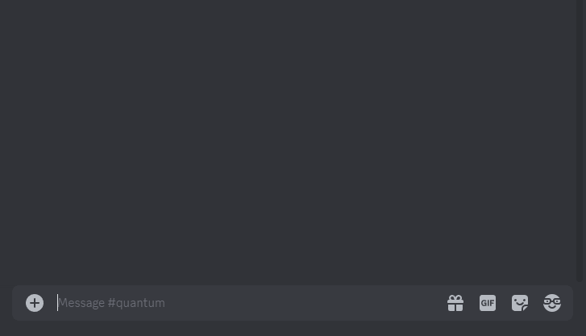

<h1 align="center">
  
<br>
  Quantum
</h1>

<h3 align="center">
  Quantum is a Better Discord plugin offering enhanced privacy through message encryption. <br>
  Just keep in mind, it's a step up from typical messaging, but absolute security isn't guaranteed.
</h3>

<p align="center">
    <a href="../../../releases/latest"></a>
  &nbsp;
  <a href="../LICENSE"></a>
  &nbsp;
  <a href="https://betterdiscord.app/"></a>
</p>



<h5 align="center">
  <a href="#prerequisites">Prerequisites</a>
  &nbsp;‒&nbsp;
  <a href="#getting-started">Getting started</a>
  &nbsp;‒&nbsp;
  <a href="#build">Build</a>
  &nbsp;‒&nbsp;
  <a href="#usage">Usage</a>
</h5>

## Prerequisites

- [git](https://git-scm.com/downloads)
- [Node.js & npm](https://docs.npmjs.com/downloading-and-installing-node-js-and-npm)
- [BetterDiscord](https://betterdiscord.app)

## Getting started

Clone the project

```bash
git clone https://github.com/imnaK/quantum
```

Go to the project directory

```bash
cd quantum
```

Install dependencies

```bash
npm install
```

Currently the secret key is still imported at build time, so a corresponding json file with the 32 byte key must be created:

```bash
node -e "require('fs').writeFileSync('.secret.json',JSON.stringify({key:require('crypto').randomBytes(32).toString('hex')}));"
```

#### Disclaimer: Please note that anyone possessing the secret key has the ability to decrypt the messages!

## Build

Build the project

```bash
npm run build
```

Build a production ready minified file

```bash
npm run build:production
```

The corresponding file `build\Quantum.plugin.js` or `build\Quantum.min.plugin.js` will be created.

Afterwards, the plugin will be automatically copied to the BetterDiscord plugin directory.

### Additional Tools

Format using the [project standard](./.prettierrc)

```bash
npm run format
```

## Usage

Use the prefix q: to write encrypted messages and decrypt them by right clicking.
